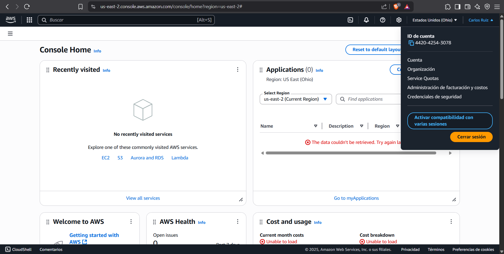
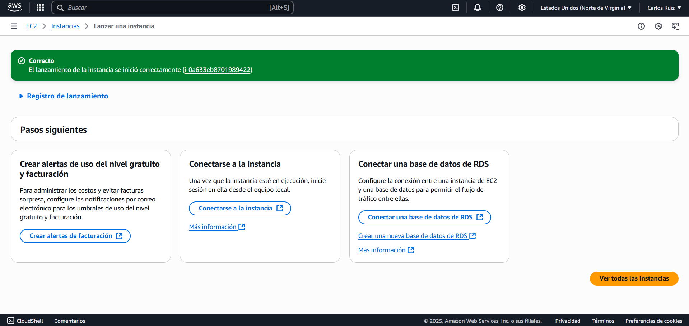
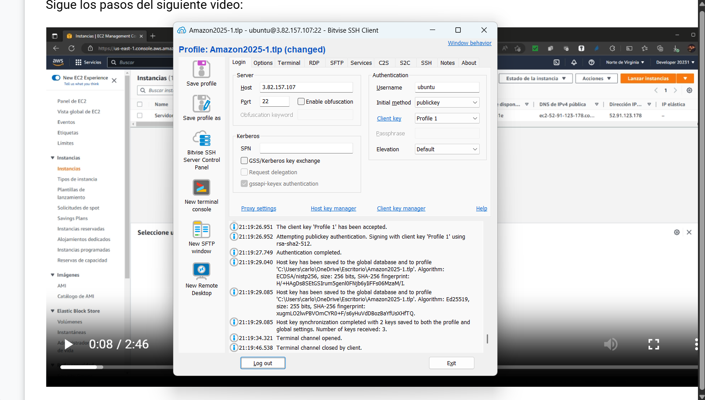
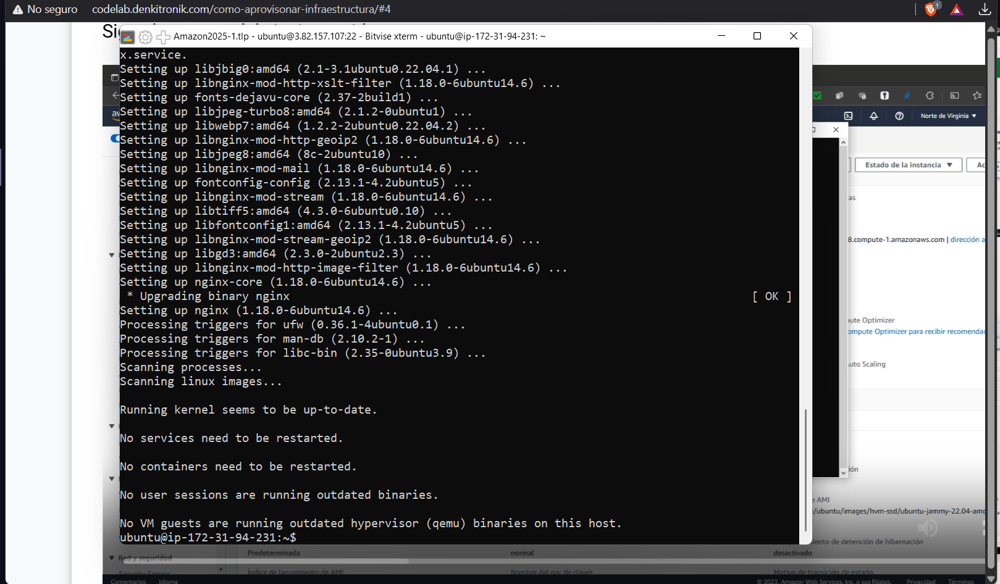
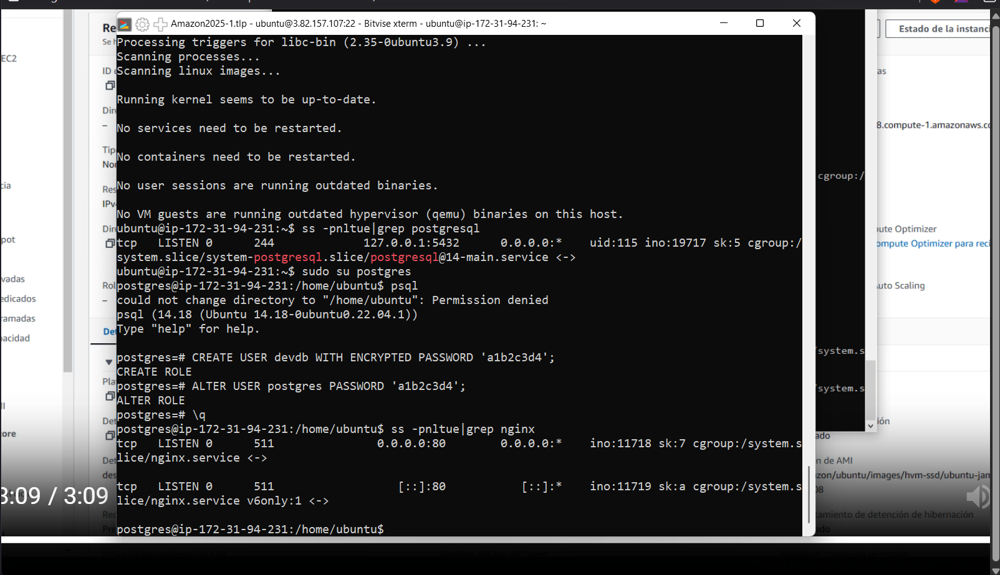
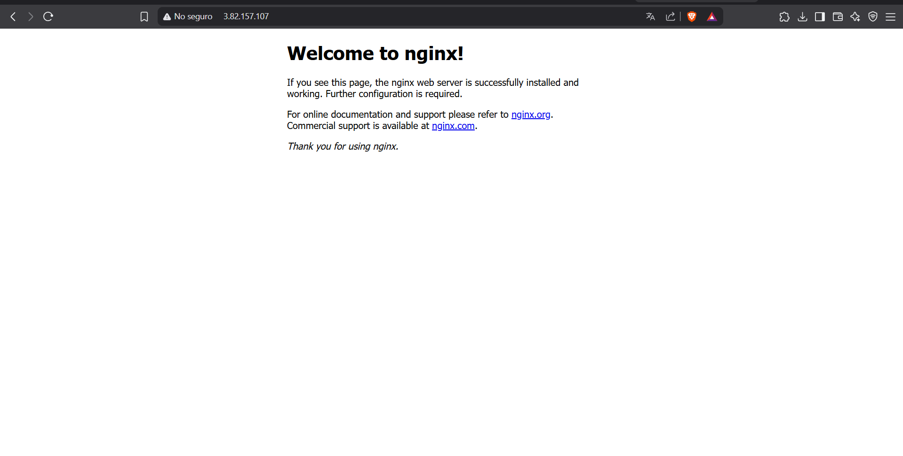
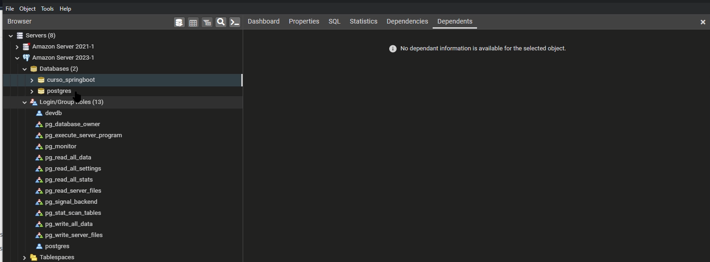
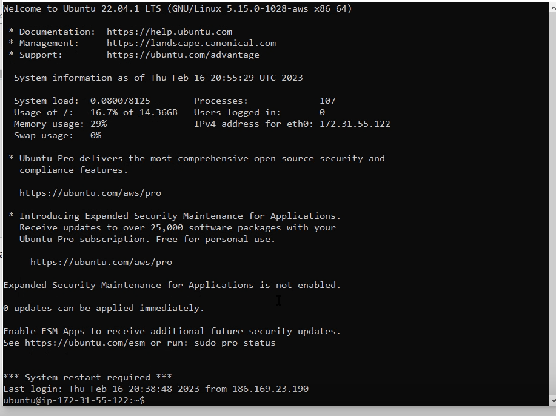

## CREAR CUENTA

## Lanzar instancia EC2

## Ingreso con SSH

## NGINX instalado

## Instalando JAVA y POSTGRESQL

## Apertura del puero Web 80

## Configuración pgadmin con postgresql

## Creando Key con passphrase
